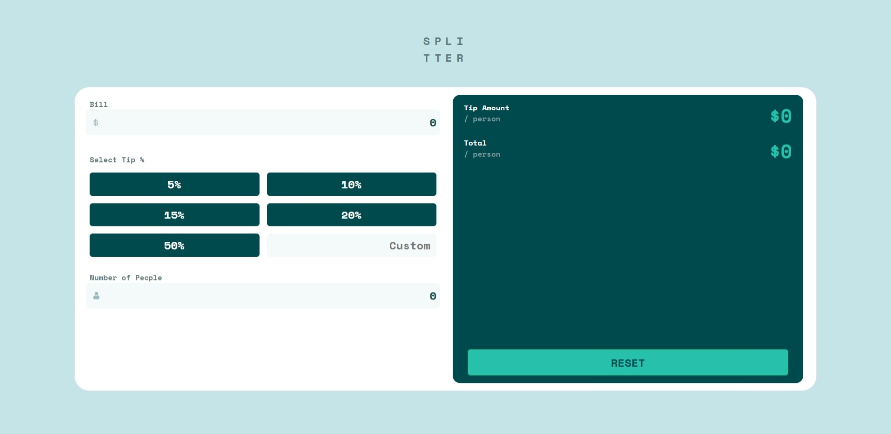

# Frontend Mentor - Tip calculator app solution

This is a solution to the [Tip calculator app challenge on Frontend Mentor](https://www.frontendmentor.io/challenges/tip-calculator-app-ugJNGbJUX). Frontend Mentor challenges help you improve your coding skills by building realistic projects.

## Table of contents

- [Overview](#overview)
  - [The challenge](#the-challenge)
  - [Screenshot](#screenshot)
  - [Links](#links)
- [My process](#my-process)
  - [Built with](#built-with)
  - [Continued development](#continued-development)
- [Author](#author))

## Overview

### The challenge

Users should be able to:

- View the optimal layout for the app depending on their device's screen size
- See hover states for all interactive elements on the page
- Calculate the correct tip and total cost of the bill per person
- Pressing **ENTER** button the calculator do the splitting
### Screenshot

### Links

- Solution URL: [Github](https://github.com/stv10/tip-splitter-react.git)
- Live Site URL: [Live Site](https://tip-splitter-react.vercel.app)

## My process

### Built with

- Semantic HTML5 markup
- CSS custom properties
- Flexbox
- CSS Grid
- Mobile-first workflow
- [React](https://reactjs.org/) - JS library
- [Bootstrap](https://tip-splitter-react.vercel.app/) - For styles

### Continued development

I think i need to practice my bootstrap skills more, designing the interface is taking a lot of time to me, learn how to use flex and grid box in a better and faster way to be more 

I didn't get to put the invalid state on the Number of people input when it is zero, so it's a thing to do in these days

**Note: Delete this note and replace the list above with resources that helped you during the challenge. These could come in handy for anyone viewing your solution or for yourself when you look back on this project in the future.**

## Author

- Frontend Mentor - [@stv10](https://www.frontendmentor.io/profile/stv10)
- LinkedIn - [My Profile](https://www.linkedin.com/in/santiago-tom%C3%A1s-villagra-01804022a/)
